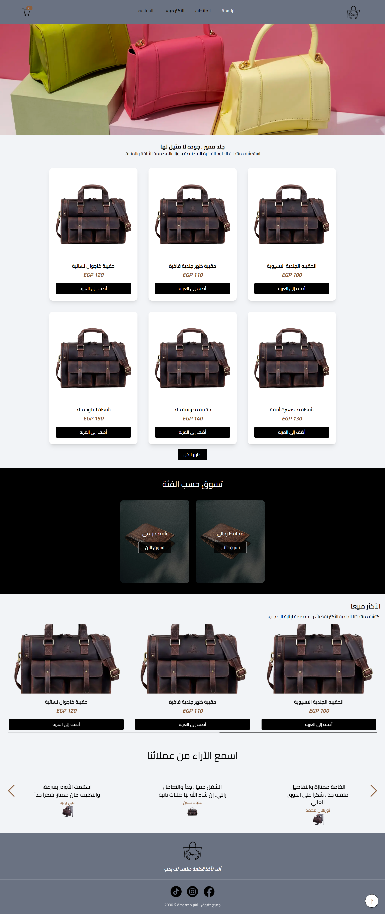
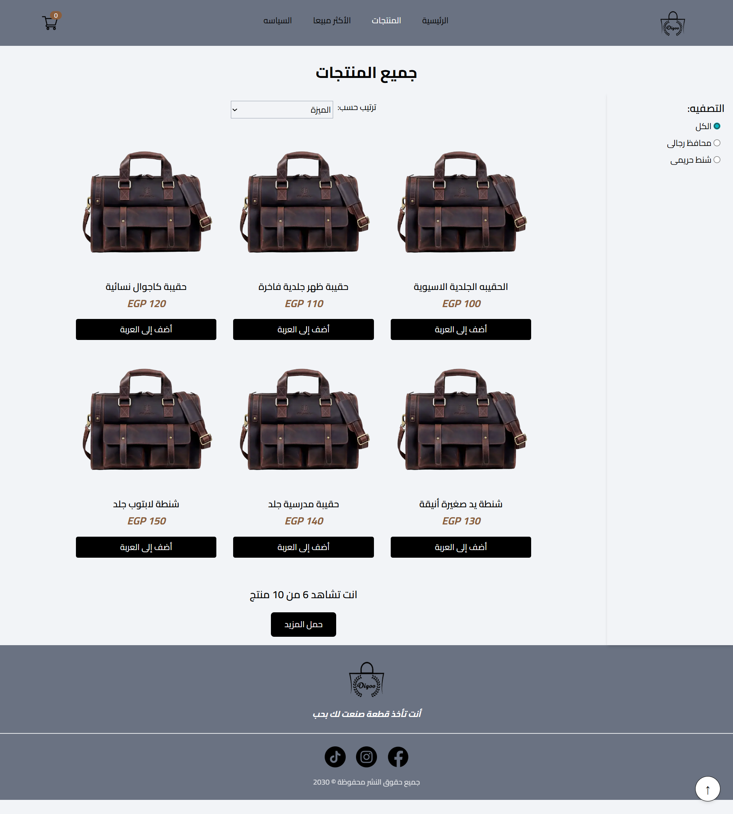
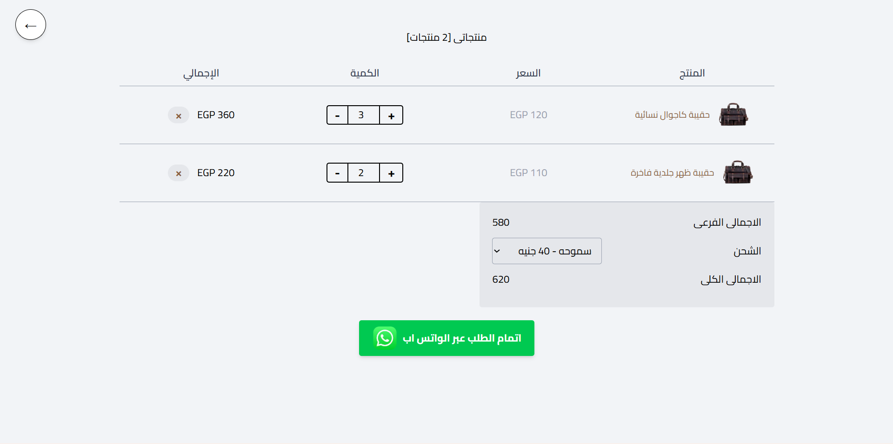
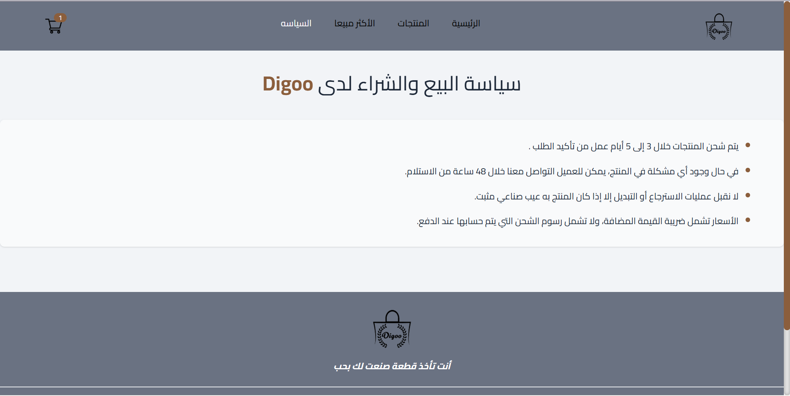

#👜 Digoo – Hand Made with Leather

Digoo is a handcrafted, leather-focused landing page built with love ❤️. It’s designed to showcase customized handmade leather products, built with Arabic support, and responsive across all devices.

The page is static but allows users to place direct orders via WhatsApp, making it simple and practical for customers.

It is built using **Next.js**, **TypeScript**, **Tailwind CSS**, and **Zustand** for global state management.

## 🚀 Features

- 🌐 **Arabic Ready**: Designed with RTL support for Arabic users.
  -📱 **Responsive Design**: Fully mobile-friendly using Tailwind CSS.
- 💬 **WhatsApp Ordering:**: Customers can place direct orders via WhatsApp.
  -⚡**Static Page**: Lightweight, fast, and optimized for performance.
  -👜**Handcrafted Products Showcase**: Highlighting leather items with elegant UI.
  -🗂️**Zustand State Management**: Clean and simple global state handling.

## Tech Stack

- ⚡ **Next.js**: A powerful React framework for building fast, server-rendered, and highly optimized user interfaces with seamless routing and performance.
  -📝 **TypeScript**: Adds static type checking to JavaScript, improving code reliability, developer productivity, and maintainability.
- 🎨 **Tailwind CSS**: A utility-first CSS framework that enables rapid, responsive, and consistent UI design with minimal custom CSS.
  -📦 **Zustand**: Minimal state management for handling cart/orders globally.

## 📸 Screenshots

| Home Section                           | Products Section                           | Cart Section                           | Policy Section                           |
| -------------------------------------- | ------------------------------------------ | -------------------------------------- | ---------------------------------------- |
|  |  |  |  |

---

## Installation

To run this project locally, follow these steps:

1. Clone the repository:
   ```bash
   git clone https://github.com/SerajEldeen/digoo.git
   cd digoo
   npm install
   ```
   ```bash
   npm run dev
   ```
